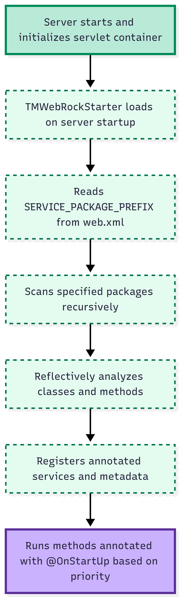
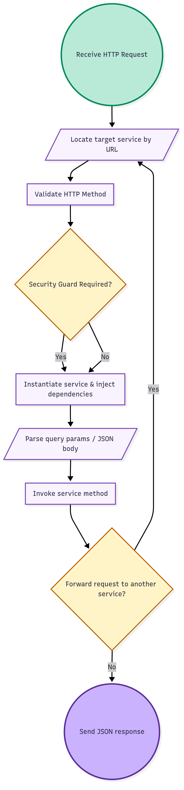

# TMWebRock

**TMWebRock** is a lightweight, annotation-driven Java web framework.
It’s not meant to replace Spring or Jakarta EE — its goal is to **teach how REST-style services, dependency injection, and servlet internals work**, while letting you build functional endpoints with minimal boilerplate.

It uses **plain servlets, reflection, and annotations**, so you can deploy it on Tomcat (or any servlet container) and start exposing services quickly, without heavy XML configs.

---

## Table of Contents

* [Overview](#overview)
* [Key Features](#key-features)
* [Getting Started](#getting-started)
* [Creating Services](#creating-services)
* [Dependency Injection & Scopes](#dependency-injection--scopes)
* [Request Handling & Forwarding](#request-handling--forwarding)
* [Security Guards](#security-guards)
* [Working with JSON](#working-with-json)
* [Example Usage](#example-usage)
* [Limitations & Future Enhancements](#limitations--future-enhancements)
* [Summary](#summary)

---

## Overview

TMWebRock is designed as a **learning-first framework**. It helps you understand:

* How to expose REST endpoints using annotations
* How dependency injection and servlet scopes work
* How request forwarding is handled internally
* How JSON request/response mapping can be automated

At startup, TMWebRock scans your configured package, discovers annotated services, and registers them automatically.

This makes it perfect for **students, interviews, and small projects** where you want to explore servlet frameworks without the complexity of Spring or Jakarta EE.

---

## TMWebRock Architecture & Request Flow

### Startup Phase
<div style="text-align: center;">
  
</div>
At server startup, TMWebRockStarter scans configured packages, registers services, and runs lifecycle hooks.

### Request Handling Phase

<div style="text-align: center; margin-top: 20px;">
  
</div>
Handles HTTP requests by locating services, validating methods, injecting dependencies, invoking methods, and forwarding or responding with JSON.


## Key Features

* **Annotation-based endpoints**: `@Path`, `@GET`, `@POST` instead of XML configuration.
* **Automatic service discovery**: package scanning at startup.
* **Dependency injection**: `@Autowired` for beans; scope injection (`request`, `session`, `application`).
* **Parameter binding**: automatically maps HTTP query/form parameters to method arguments.
* **Forwarding**: `@Forward` lets you forward requests to another service or JSP.
* **Security guards**: pre-execution validation using `@SecuredAccess`.
* **Lifecycle hooks**: methods with `@OnStartUp` run at framework initialization.
* **JSON support**: Gson serializes/deserializes request and response bodies automatically.

---

## Getting Started

### Requirements

* **JDK 8+**
* **Servlet container** (Tomcat recommended)
* Basic knowledge of Java and HTTP

### Setup (`web.xml`)

Users need to configure **service packages and URL mappings**, while the framework provides the servlets.

#### 1. Define your service package (User)

```xml
<context-param>
    <param-name>SERVICE_PACKAGE_PREFIX</param-name>
    <param-value>com.example.services</param-value>
</context-param>
```

> Replace `com.example.services` with the package where your service classes are located.

---

#### 2. Register Framework Servlets (Framework)

```xml
<servlet>
    <servlet-name>TMWebRockStarter</servlet-name>
    <servlet-class>com.thinking.machines.webrock.TMWebRockStarter</servlet-class>
    <load-on-startup>1</load-on-startup>
</servlet>

<servlet>
    <servlet-name>TMWebRock</servlet-name>
    <servlet-class>com.thinking.machines.webrock.TMWebRock</servlet-class>
</servlet>
```

> These servlets are provided by the framework — users should only declare them in `web.xml`.

---

#### 3. Map the service URL (User)

```xml
<servlet-mapping>
    <servlet-name>TMWebRock</servlet-name>
    <url-pattern>/services/*</url-pattern>
</servlet-mapping>
```

> The **user chooses** the URL pattern (e.g., `/services/*`). This is the base path for all service endpoints.

---

#### 4. Deploy

1. Place your annotated service classes in the configured package.
2. Compile into `WEB-INF/classes`.
3. Package as a WAR and deploy to Tomcat.

On startup, **TMWebRockStarter** scans your package and registers services automatically.

---

## Creating Services

A service is just a **Java class with annotations**:

```java
@Path("/calculator")
@GET
public class CalculatorService {

    @Path("/add")
    public int add(@RequestParameter("a") int a,
                   @RequestParameter("b") int b) {
        return a + b;
    }
}
```

* `@Path` on the class → base URL path (`/calculator`)
* `@Path` on the method → extends the path (`/add`)
* Final URL → `/services/calculator/add?a=10&b=20`
* `@RequestParameter` → binds query params to method arguments

---

## Dependency Injection & Scopes

### Bean Injection

```java
@Autowired(name = "user")
private User user;
```

### Scope Injection

```java
@InjectSessionScope
@InjectRequestScope
@InjectApplicationScope
public class ExampleService {

    private SessionScope session;
    private RequestScope request;
    private ApplicationScope application;

    public void setSessionScope(SessionScope session) { this.session = session; }
    public void setRequestScope(RequestScope request) { this.request = request; }
    public void setApplicationScope(ApplicationScope application) { this.application = application; }
}
```

* Access `session`, `request`, and `application` data directly in your services.
* `@Autowired` injects beans by name.

---

## Request Handling & Forwarding

Forward requests internally with `@Forward`:

```java
@Path("/start")
@Forward("/calculator/add")
public void start() {
    // optional logging or preprocessing
}

@Path("/add")
public int add(@RequestParameter("a") int a,
               @RequestParameter("b") int b) {
    return a + b;
}
```

---

## Security Guards

Protect services with `@SecuredAccess`:

```java
@SecuredAccess(checkpost = "com.example.guards.AuthGuard", guard = "checkUser")
@Path("/secure")
public class SecureService {
    // secure endpoints here
}
```

* Guard methods receive injected scopes and can throw exceptions if access is denied.

---

## Working with JSON

POST methods can directly accept JSON payloads:

```java
@Path("/student")
@POST
public void addStudent(Student student) {
    // student object auto-deserialized from JSON
}
```

Returning an object automatically serializes it to JSON — no extra code required.

---

## Example Usage

A simple student CRUD service:

```java
@Path("/studentService")
public class StudentService {

    @Path("/add")
    @POST
    public void add(Student student) {
        // validation + insert
    }

    @Path("/getAll")
    @GET
    public List<Student> getAll() {
        // fetch + return student list
    }
}
```

Frontend (jQuery example):

```javascript
$.ajax({
    type: "POST",
    url: "services/studentService/add",
    data: JSON.stringify({ rollNumber: 101, name: "Alice" }),
    contentType: "application/json",
    success: function() { alert('Student added!'); }
});
```

---

## Limitations & Future Enhancements

* Only scans exploded class files (no JAR scanning yet)
* Supports only `GET` and `POST`
* Basic error handling; could be more detailed
* Can be extended with more annotations and features
* No Maven/Gradle integration yet

---

## Summary

TMWebRock is a **learning-first servlet-based framework**:

* Understand annotations, DI, request forwarding, and scopes
* Build REST endpoints with minimal boilerplate
* Experiment with JSON serialization/deserialization

Think of it as a **hands-on educational framework** — lightweight but functional enough to build real endpoints.

---
